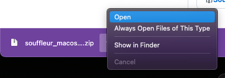
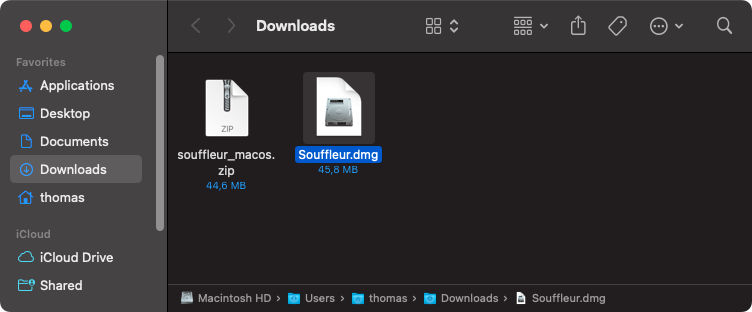
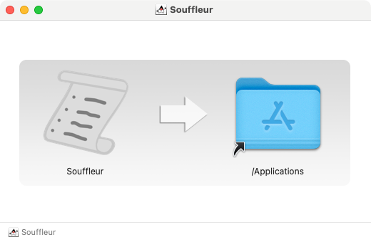
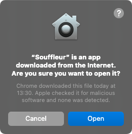
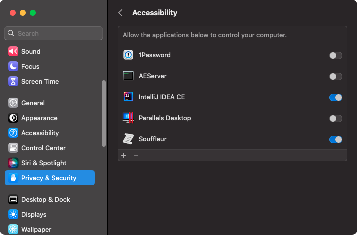

On this page, I'll explain how to download, install, and setup the *Souffleur* server. 

*Souffleur* consists of two parts:

1. The **mobile app**: you'll be using it to flip through slides. When you press its *next page* button, the app sends a command to the **Souffleur server**
2. The **Souffleur server**: it runs on your laptop. It receives commands from the **mobile app** and instructs the operating system of your laptop to send key strokes to the topmost window. If this is your presentation software, this will flip the slides.

## Download and install

### macOS

<ol>
<li>Download and open (unpack) the installation archive. </li>
<li>You will see <em>Souffleur.dmg</em>.Please open it. </li>
<li>You will see two icons, <em>Souffleur</em> and an alias named <em>Applications</em>. Please drag the <em>Souffleur</em> icon onto <em>Applications</em>. </li>
</ol>

### Windows

tbd

## Setup and usage

### macOS

<ol>
<li>If you open <em>Souffleur</em> for the first time, <em>macOS</em> reminds you that you downloaded <em>Souffleur</em> from the Internet. Please select <em>Open</em> to open the app. </li>
<li><em>Souffleur</em> sends keystrokes to the topmost application window in order to flip through your slides. Please make sure that <em>Souffleur</em> appears in the list in <em>Settings &gt; Privacy &amp; Security &gt; Accessibility</em>, and its switch is enabled. </li>
</ol>

