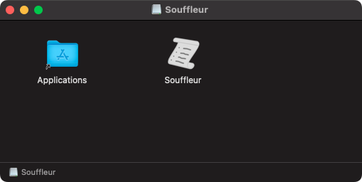
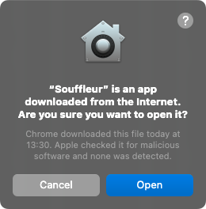
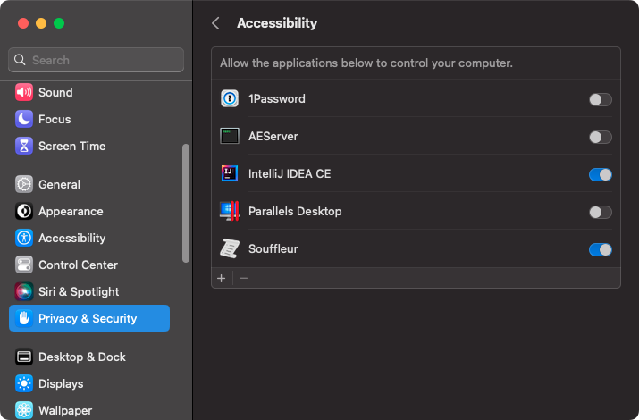

This page guides you through the installation and setup of *Souffleur*. Don't worry, it's just a few steps.

## Download and installation

### macOS

<ol>
<li>Download and open (unpack) the installation archive. </li>
<li>You will see <em>Souffleur.dmg</em>.Please open it. </li>
<li>You will see two icons, <em>Souffleur</em> and an alias named <em>Applications</em>. Please drag the <em>Souffleur</em> icon onto <em>Applications</em>. </li>
</ol>

### Windows

tbd

## Setup and usage

### macOS

<ol>
<li>If you open <em>Souffleur</em> for the first time, <em>macOS</em> reminds you that you downloaded <em>Souffleur</em> from the Internet. Please select <em>Open</em> to open the app. </li>
<li><em>Souffleur</em> sends keystrokes to the topmost application window in order to flip through your slides. Please make sure that <em>Souffleur</em> appears in the list in <em>Settings &gt; Privacy &amp; Security &gt; Accessibility</em>, and its switch is enabled. </li>
</ol>

